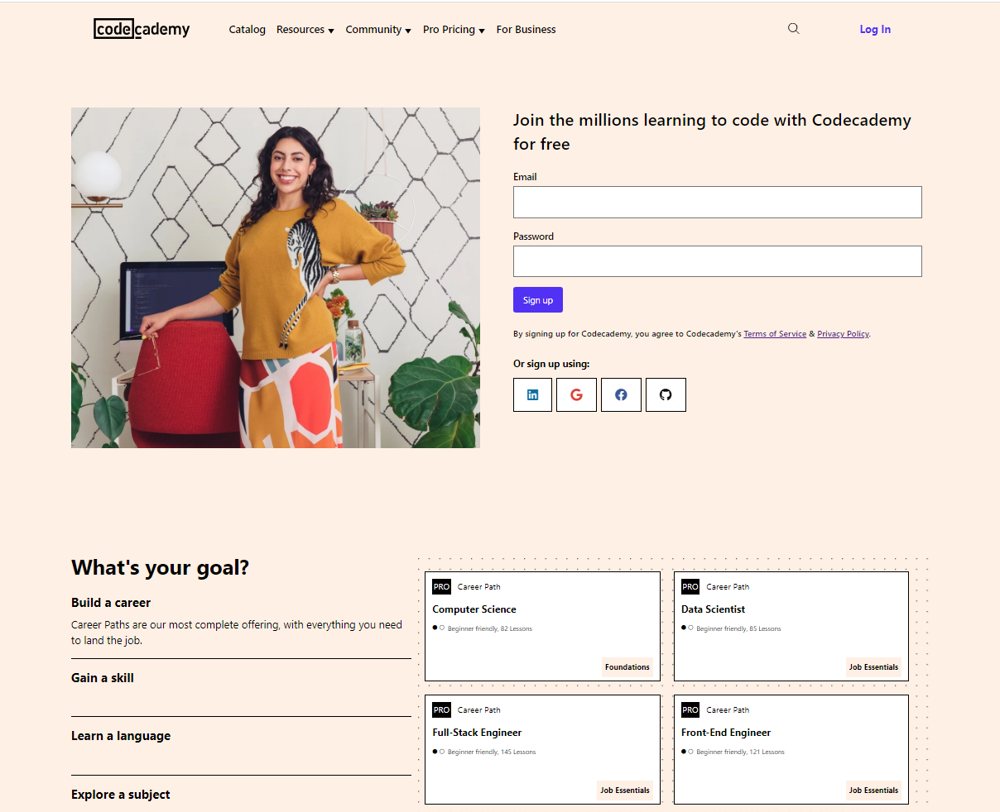

# Codeacademy Clone

This a clone of codeacademy.com website using HTML and CSS. Worthy to mention Font Awesome as well.

Please note that the website has changed since then.

### Link:

https://cometbroom.github.io/CODEACADEMY-clone/

Here's a screenshot to my clone:

### Development

Like my other clone projects, I did this without copying anything other than img assets to deeply understand the CSS and HTML concepts. Also like my other CSS projects I made heavy use of CSS Grid.